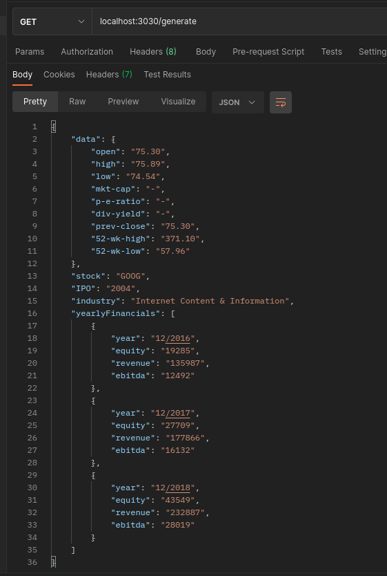

<p align="center">
	<h1 align="center">Olivia AI web scraping :page_facing_up: :tm:</h1>
</p>

<p align="center">
  <a href="#-Technologies">Technologies</a>&nbsp;&nbsp;&nbsp;|&nbsp;&nbsp;&nbsp;
  <a href="#-Project">Project</a>&nbsp;&nbsp;&nbsp;|&nbsp;&nbsp;&nbsp;
  <a href="#-How-to-run-project">How to run</a>&nbsp;&nbsp;&nbsp;|&nbsp;&nbsp;&nbsp;
  <a href="#-How-to-improve-that">How to run</a>&nbsp;&nbsp;&nbsp;|&nbsp;&nbsp;&nbsp;
  <a href="#memo-license">License</a>
</p>

<p align="center">
 

  
</p>

<br>

## :heavy_check_mark: :computer: :arrow_right: Result

<h1 align="center">
    
</h1>

## 🚀 Technologies

This project was developed with the following technologies:

- [Node.js](https://node.org/)
- [Typescript](https://www.typescriptlang.org/)
- [Express](https://expressjs.com/pt-br/)
- [Cheerio](https://cheerio.js.org/)
- [Playwright](https://playwright.dev/)
- [Playwright](https://playwright.dev/)
- [Axios](https://www.npmjs.com/package/axios)
- [Axios retry](https://www.npmjs.com/package/axios-retry)

## 💻 Project

This is a **_Olivia AI web scraping challenge_**, is a Project that **use the Node.js, Typescript, Express, Cheerio and Playwright**. In order to finish the Olivia Ai challenge.

## 🤔 How to run project

- Clone the project using `git clone https://github.com/oliveirabalsa/olivia-ai-web-scraping`;
- Run: `npm install` at source folder;
- Run: `npm start` and the server will start;
- Using Postman, Insomnia or your favorite browser do a GET request in: `localhost:3030/generate`.

After these steps you will get the response:

```json
{
  "data": {
    "open": "75.30",
    "high": "75.89",
    "low": "74.54",
    "mkt-cap": "-",
    "p-e-ratio": "-",
    "div-yield": "-",
    "prev-close": "75.30",
    "52-wk-high": "371.10",
    "52-wk-low": "57.96"
  },
  "stock": "GOOG",
  "IPO": "2004",
  "industry": "Internet Content & Information",
  "yearlyFinancials": [
    {
      "year": "12/2016",
      "equity": "19285",
      "revenue": "135987",
      "ebitda": "12492"
    },
    {
      "year": "12/2017",
      "equity": "27709",
      "revenue": "177866",
      "ebitda": "16132"
    },
    {
      "year": "12/2018",
      "equity": "43549",
      "revenue": "232887",
      "ebitda": "28019"
    }
  ]
}
```

The project use axios retry in order to solve the unstable api and local cache

## ⚙️ How to improve that

- I implemented a local cache, one thing that would improve the app is to make this cache in redis or another type of application;

- Implement dependency injection.

- Implement documentation about the endpoint and increase more than one

## :memo: License

This project is under License MIT. See the documentation [LICENSE](LICENSE) for more details.

---

<p align="center">Developed by <a href="https://www.linkedin.com/in/leonardo-balsalobre/">Leonardo Balsalobre</a> :copyright:
